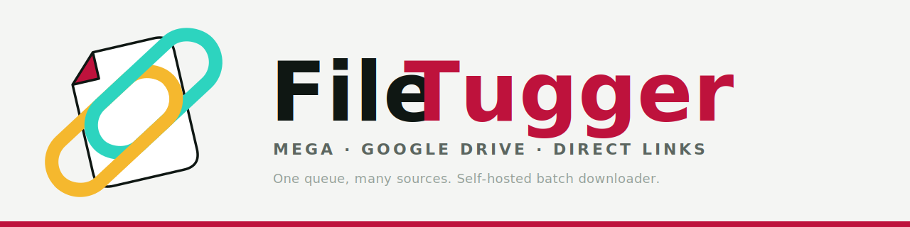
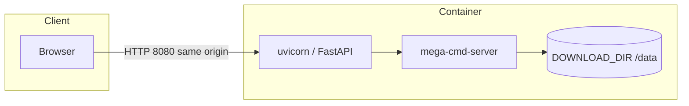

<div align="center">


[](https://github.com/flaviocfneto/mega-get-server/actions/workflows/test.yml)
[](https://github.com/flaviocfneto/mega-get-server/actions/workflows/quality.yml)
[](https://github.com/flaviocfneto/mega-get-server/actions/workflows/docker-build.yml)
[](https://github.com/flaviocfneto/mega-get-server/actions/workflows/codeql.yml)
[](LICENSE)

**🐳 Pull MEGA.nz exports onto your NAS or homelab—Vite + React UI, FastAPI + MEGAcmd, one container on port 8080.**

[Frontend docs](web/README.md) · [Layout & compatibility](docs/COMPAT-LAYOUT.md) · [Dev tools](docs/dev-tools.md)



</div>

# mega-get-server

## Table of contents

- [Overview](#overview)
- [Features](#features)
- [Quick start](#quick-start)
- [Architecture](#architecture)
- [Configuration](#configuration)
- [Diagnostics & API](#diagnostics--api)
- [Local development](#local-development)
- [Testing](#testing)
- [Branding](#branding)
- [Contributing](#contributing)
- [License](#license)

## Overview

**FileTugger** is the product name for this stack: a Docker image that runs
`mega-cmd-server` plus **uvicorn** serving a **FastAPI** app and the built
**React** SPA from `web/`. You paste or drop MEGA links; files land in a volume
you mount (typically `/data`). Same-origin UI on **port 8080**—no separate
`EXTERNAL_HOST` wiring for normal deployments.

This repo is the source for images published to **GHCR** as
`ghcr.io/flaviocfneto/linktugger` (see [Publish Images](.github/workflows/publish.yml)).

## Features

- **📥 Transfers** — Add links, watch active downloads, paths respect
  `PATH_DISPLAY_SIZE` and list limits.
- **📜 History and queue** — Saved links, app queue, and download history;
  choosing a URL jumps to Transfers and fills the form.
- **📊 Analytics** — Usage-oriented views backed by the API.
- **🖥️ Logs & terminal** — Server log stream plus MEGAcmd terminal in one shell
  (see [web/README.md](web/README.md)).
- **🔒 Sensible defaults** — Optional API keys, CORS, CSRF, and rate limiting
  (see [api/security.py](api/security.py) and [Configuration](#configuration)).

## Quick start

Pull the image from GHCR (after a [release](.github/workflows/publish.yml) or
your own build) and run:

```bash
docker run \
  --detach --restart unless-stopped \
  --publish 8080:8080 \
  --volume /mnt/your-downloads:/data/ \
  ghcr.io/flaviocfneto/linktugger:latest
```

Open **http://\<host\>:8080** in a browser. Downloads go to `/data` inside the
container—mount a host path as shown.

**File ownership:** By default, files may be owned by the container user. Use
`docker run --user` and the `NEW_*_PERMISSIONS` variables below to match your
host expectations.

## Architecture



The production image builds the frontend (`npm run build` in `Dockerfile`),
copies `dist` to `/app/static`, and serves it through FastAPI alongside `/api`.

## Configuration

### Core download & UI tuning

| Variable | Default | Role |
| -------- | ------- | ---- |
| `DOWNLOAD_DIR` | `/data/` | Where MEGAcmd writes completed downloads. |
| `NEW_FILE_PERMISSIONS` | `600` | File mode for new files (`mega-permissions`). |
| `NEW_FOLDER_PERMISSIONS` | `700` | Folder mode for new folders. |
| `TRANSFER_LIST_LIMIT` | `50` | Max transfers surfaced in the UI. |
| `PATH_DISPLAY_SIZE` | `80` | Max characters shown for paths. |
| `INPUT_TIMEOUT` | `0.0166` | Lower bound for transfer-list polling (seconds). |
| `FLET_SERVER_PORT` | `8080` | HTTP listen port (see [entrypoint.sh](files/entrypoint.sh)). |

### MEGAcmd & simulation

| Variable | Default | Role |
| -------- | ------- | ---- |
| `MEGACMD_PATH` | _(empty)_ | Directory containing MEGA binaries when not on default PATH. |
| `MEGA_SIMULATE` | off | Set `1` for simulated MEGA behavior (tests / no MEGAcmd). |
| `UI_TEST_MODE` | off | Relaxes some behaviors for automated UI testing. |

### HTTP downloads & tooling

| Variable | Default | Role |
| -------- | ------- | ---- |
| `HTTP_DOWNLOADS_ENABLED` | `1` | Toggle non-MEGA HTTP download path. |
| `WGET_HTTP_BIN` | `wget2` | Binary used for HTTP fetches. |

### Queues & correlation (backend)

| Variable | Default | Role |
| -------- | ------- | ---- |
| `PENDING_QUEUE_MAX_ITEMS` | _(internal default)_ | Cap for in-memory pending queue items. |
| `PENDING_CORRELATION_MAX_ENTRIES` | _(internal default)_ | Cap for pending correlation map. |

### Security & CORS (optional hardening)

| Variable | Default | Role |
| -------- | ------- | ---- |
| `API_AUTH_MODE` | `optional` | Set `strict` to require keys on protected routes. |
| `API_WRITE_KEY` | _(empty)_ | Key for write scope when auth is strict. |
| `API_ADMIN_KEY` | _(empty)_ | Key for admin scope when auth is strict. |
| `API_AUTH_TRANSPORT` | `header_key` | How clients send keys (e.g. `X-Api-Key` header). |
| `CORS_ALLOW_ORIGINS` | `http://localhost:5173` | Comma-separated allowed origins (set for real deployments). |
| `CSRF_ENFORCEMENT_MODE` | `origin_only` | CSRF boundary for unsafe HTTP methods. |
| `CSRF_HEADER_NAME` | `x-csrf-token` | Header name for CSRF token when applicable. |

## Diagnostics & API

Tool readiness (versions, install hints, impacted features):

```bash
curl -s http://127.0.0.1:8080/api/diag/tools | jq
```

Log buffer:

```bash
curl -s http://127.0.0.1:8080/api/logs | jq
curl -s -X DELETE http://127.0.0.1:8080/api/logs
```

The app does **not** auto-install dependencies; diagnostics only report status
and suggest commands.

## Local development

From the repo root, start API + Vite with one command:

```bash
node start-dev.mjs
```

Defaults: FastAPI at `http://127.0.0.1:8000`, UI at `http://localhost:5173`.
Overrides: `API_HOST`, `API_PORT`, `UI_PORT`. Platform scripts (`start-dev.sh`,
`start-dev.bat`, `start-dev.ps1`) remain available.

Frontend-only details (proxy, deep links, tests): **[web/README.md](web/README.md)**.

## Testing

**Backend (pytest):**

```bash
python3 -m venv .venv
source .venv/bin/activate
pip install -r api/requirements.txt pytest
PYTHONPATH=api MEGA_SIMULATE=1 UI_TEST_MODE=1 pytest api/tests -v
```

With MEGAcmd on macOS, you may need:

```bash
brew install --cask megacmd
export MEGACMD_PATH=/Applications/MEGAcmd.app/Contents/MacOS
```

**Frontend:** from `web/`, run `npm test`, `npm run e2e`, and (with a build)
`npm run check:bundle` / `npm run lhci` as described in [web/README.md](web/README.md).

## Branding

Canonical brand assets and tokens live under **[DESIGN/](DESIGN/)** (see
[DESIGN/docs/BRAND.md](DESIGN/docs/BRAND.md)). Runtime copies are under
`web/public/` (icons, wordmark). Vector sources include
[DESIGN/logos/ft-readme-banner.svg](DESIGN/logos/ft-readme-banner.svg); repo
root [logo.png](logo.png) is a raster mark for README and social previews.

## Contributing

Issues and PRs are welcome. Match existing patterns; run Python tests and
`web/` lint/tests when you touch those areas. Follow [CODEOWNERS](.github/CODEOWNERS) for review routing.

## License

Distributed under the **MIT License** — see [LICENSE](LICENSE).

⭐ Star the repo if FileTugger saved you a trip through the MEGA web UI on a headless box.
